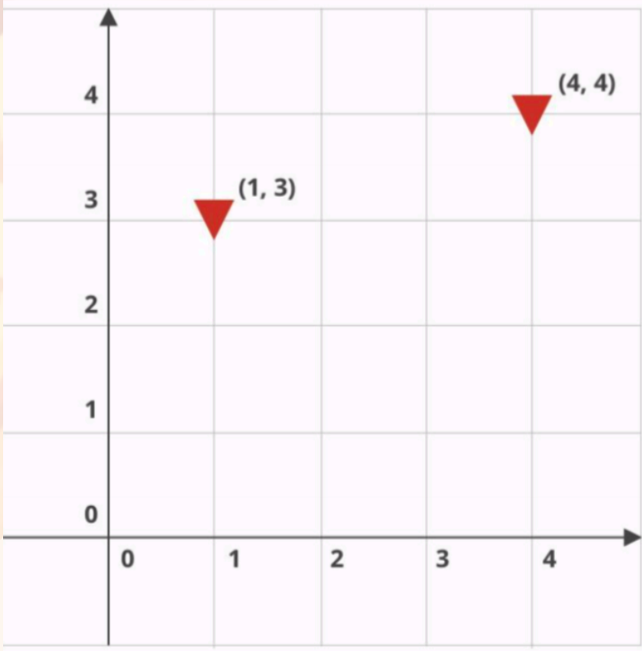

# Slice Challenge / Pizzabot

Command-line application for getting instructions for pizzabot to deliver pizza 

## Challenge 

Instruct Pizzabot on how to deliver pizzas to all the houses in a neighborhood. In more specific terms, given a grid (where each point on the grid is one house) and a list of points representing houses in need of pizza delivery, return a list of instructions for getting Pizzabot to those locations and delivering.

## How it works

Pizzabot moves on the grid by the following commands:
 - N: Move north
 - S: Move south
 - E: Move east
 - W: Move west
 - D: Drop pizza

Pizzabot always starts at the origin point, (0, 0). As with a Cartesian plane, this point lies at the most south- westerly point of the grid.

For example we have the following **"5x5 (0,0) (1, 3) (4, 4)"** input.



We set grid size and list of points in the format: **"5x5 (0,0) (1, 3) (4, 4).."**:
- **5x5** - grid *width* and *height* parameters
- **(0,0)** - bot start point
- **(1, 3) (4, 4)** - destination points

Pizzabot sends you correct list of instructions. it will send you **"ENNNDEEEND"** for **"5x5 (0,0) (1, 3) (4, 4)"** input.

## How to execute 

Enter input string using the following format: grid dimensions separated by "x" character followed by any number of points in parentheses separated by comma. The number of spacers between characters doesn't matter.

### In Xcode

- Open ```SliceChallenge.xcodeproj``` in the project folder
- Select the  ```SliceChallenge``` scheme
- Click ▶️ button or just use shortcut ```cmd+R```
